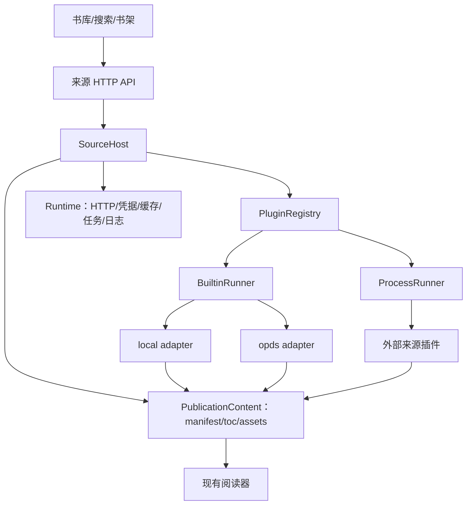

# 来源插件系统设计

状态：设计已确定，服务端首个切片已实现

适用接口：`/api/v1`，来源插件协议 1

更新日期：2026-09-20

本文定义 reader 对本地书库、OPDS 书库和远程书源的统一扩展架构。目标是让核心程序只维护一套书架、阅读、缓存和任务逻辑；内置 `local`、`opds` 两种来源；远程书源以独立插件开发、安装和升级。

本文区分目标架构和本轮交付。当前已实现 local、OPDS 下载入库、受信任 Node 来源插件及管理接口；外部章节提供目录和资源开发预览，尚未接入书架、离线缓存和追更。交付状态与验证见 §13，调用示例见 [API 参考](api.md#来源与插件)。

## 1. 目标与范围

### 1.1 目标

- 通过同一套来源接口支持本地书、OPDS 目录和远程章节书源。
- 新增远程站点时只安装或更新插件，不修改核心路由、书架和阅读器。
- 将来源协议复杂性封装在深模块内：调用方只理解发现、详情和获取内容。
- 让文件内容和在线章节都进入现有 `manifest / toc / assets` 阅读协议。
- 插件崩溃、超时或禁用时，不破坏书架、阅读进度和已经缓存的内容。
- 插件升级保持来源引用和章节身份稳定，并支持可验证的状态迁移。
- 通过能力声明、凭据隔离、网络权限和独立进程降低插件风险。

### 1.2 完整版本目标范围

包括：

- 宿主插件注册表、安装/启用/禁用/升级流程。
- 内置 `local`：扫描 `BOOKS_DIR`，复用现有格式处理器。
- 内置 `opds`：支持 OPDS 1.x Atom、OPDS 2 JSON、导航、分页、搜索（若目录提供）和文件获取。
- 外部 Node.js 进程插件及版本化 RPC。
- 远程书源的搜索、详情、目录、章节正文和图片资源。
- 宿主统一缓存、下载任务、限流、错误码和日志。
- 来源配置 JSON Schema 和凭据引用。

不包括：

- 插件直接替换阅读器 UI 或注入任意前端代码。
- 不可信插件的完整操作系统级沙箱。首个切片只运行管理员明确安装的受信任插件；需要容器或系统沙箱时另行实现。
- 自动把不同来源的版本合并为同一作品并迁移进度。先保留独立版本，后续可增加可选 `workId`。

## 2. 术语与设计原则

| 术语 | 定义 |
| --- | --- |
| 插件包（Plugin package） | 可安装、校验、升级的代码与声明，例如 `reader.source.example`。 |
| 来源实例（Source instance） | 一个具体配置，例如 `/books`、某个 OPDS 地址或一个站点账号。 |
| 来源条目（Source entry） | 来源目录中的书，以 `(sourceInstanceId, externalId)` 标识。 |
| 出版物（Publication） | 可阅读的具体版本，拥有自己的目录、章节/文件和定位体系。 |
| 资源（Resource） | 文件、章节正文、图片、字体等可读取内容。 |
| 宿主（Host） | reader 服务端，负责插件调度和用户数据。 |

设计遵循 `docs/architecture.md` 的数据边界：`BOOKS_DIR` 是用户书库，`DATA_DIR` 存数据库、下载、缓存和插件状态。插件不直接访问宿主数据库，也不把任意路径或远程 URL 交给客户端。

来源接口是外部 seam。`local`、`opds` 和远程插件是该 seam 上的 adapter；宿主将鉴权、任务、缓存、资源流和错误语义放在接口之后，调用方不需要知道每个来源的协议细节。

## 3. 总体架构



### 3.1 模块职责

| 模块 | 职责 | 不负责 |
| --- | --- | --- |
| `PluginRegistry` | 发现插件包、校验 manifest、选择版本、记录状态 | 不执行来源业务 |
| `SourceHost` | 将来源调用包装成统一接口；管理实例、能力、超时、任务 | 不解析具体网站规则 |
| `BuiltinRunner` | 在宿主进程内运行受控的 `local` 和 `opds` adapter | 不加载外部任意代码 |
| `ProcessRunner` | 启动和监督外部插件进程，执行 RPC、取消和资源流 | 不拥有书架或用户数据 |
| `Runtime` | HTTP、凭据、命名空间存储、缓存、限流、日志、取消 | 不定义来源协议 |
| `PublicationContent` | 将文件或章节绑定转换为统一阅读协议 | 不负责搜索和目录发现 |
| `JobManager` | 下载、扫描、刷新目录、离线缓存、重试和进度 | 不修改插件内部状态 |
| `Book/Shelf` | 持久化 publication、书架、进度、笔记 | 不根据书名猜测来源身份 |

## 4. 来源接口

接口以 [`server/src/sources/types.ts`](../server/src/sources/types.ts) 为准。以下摘录首个切片的 SDK 契约；可选能力通过 `capabilities` 声明，注册表拒绝声明能力却缺少对应方法的提供者。

```ts
interface SourceProvider {
  readonly descriptor: SourceDescriptor;
  validateConfig?(config: unknown): void | Promise<void>;
  browse?(ctx: SourceContext, request: BrowseRequest): Promise<CatalogPage>;
  search?(ctx: SourceContext, request: SearchRequest): Promise<CatalogPage>;
  detail(ctx: SourceContext, entryRef: string): Promise<CatalogEntry>;
  acquire(ctx: SourceContext, request: AcquireRequest): Promise<Acquisition>;
  openFile?(ctx: SourceContext,
    acquisition: Extract<Acquisition, { kind: 'file' }>): Promise<ResourceResponse>;
  getManifest?(ctx: SourceContext, publicationRef: string): Promise<ManifestSnapshot>;
  readResource?(ctx: SourceContext, request: ResourceRequest): Promise<ResourceResponse>;
}
```

`SourceProvider` 的接口保持小而稳定。适配器内部可以实现规则解析、登录流程、分页协议和站点兼容逻辑；宿主只依赖这些方法的输入、输出、取消、超时和错误不变量。

### 4.1 目录和条目

```ts
interface SourceDescriptor {
  id: string;
  label: string;
  version: string;
  capabilities: SourceCapability[];
  configSchema?: unknown;
}

interface CatalogPage {
  items: CatalogEntry[];
  navigation?: NavigationEntry[];
  nextCursor?: string;
  title?: string;
}

interface NavigationEntry {
  ref: string;
  title: string;
  kind?: 'catalog' | 'search' | 'collection';
}

interface CatalogEntry {
  ref: string;
  title: string;
  authors?: string[];
  description?: string;
  language?: string;
  coverUrl?: string;
  options?: AcquisitionOption[];
  metadata?: Record<string, unknown>;
}
```

`entryRef`、游标和导航引用由来源解释。宿主只做不透明保存和回传，不拼接 URL，也不把它当作数据库主键。

### 4.2 内容获取

```ts
type Acquisition =
  | { kind: 'ready'; publicationId: string }
  | { kind: 'file'; acquisitionRef: string; mediaType: string }
  | { kind: 'chapters'; publicationRef: string }
  | { kind: 'action-required'; action: AcquisitionAction };
```

`Acquisition` 是提供者返回给宿主的内容绑定。`local` 可以返回已经存在的 `publicationId`；远程提供者返回文件或章节引用，由宿主分配稳定身份并处理获取流程。任何 `ready` ID 都必须由宿主验证确实存在且调用用户有权访问，不能直接信任外部插件的声明。后续引入持久化任务时，HTTP 响应可新增 `pending/jobId`，它不是首个切片的插件返回值。

文件内容和章节内容由宿主内部统一为：

```ts
interface PublicationContent {
  manifest(ctx: ReadContext): Promise<ManifestSnapshot>;
  toc(ctx: ReadContext): Promise<TocEntry[]>;
  asset(ctx: ReadContext, ref: string): Promise<ResourceResponse>;
}
```

SDK 的 `ResourceResponse` 支持 `mediaType`、`size`（若已知）、`data`、`text` 和 `stream`。内置 OPDS 提供者通过流下载。首个外部进程只支持章节来源，声明 `acquire.file` 会被拒绝；资源使用有大小上限的 `text/base64` JSON，适合章节和小图片。HTTP 开发预览始终返回 JSON，不在应用同源下直接执行插件 HTML。后续资源通道支持背压和取消后，外部插件才适合传输大文件。

### 4.3 能力

首个切片的能力枚举：

```text
browse
search
detail
acquire.file
acquire.chapters
content.manifest
content.resource
content.update
```

来源级能力决定 UI 是否显示入口；条目级 `options` 决定本书是否支持某种格式、下载或试读。能力缺失统一返回 `CAPABILITY_UNSUPPORTED`。

## 5. 插件包与 SDK

### 5.1 manifest

```json
{
  "id": "reader.source.example",
  "name": "示例远程书源",
  "version": "1.0.0",
  "apiVersion": 1,
  "runtime": "node",
  "entry": "dist/main.js",
  "sourceTypes": [
    {
      "id": "example",
      "label": "示例书源",
      "capabilities": ["search", "detail", "acquire.chapters", "content.manifest", "content.resource"],
      "configSchema": { "type": "object", "properties": {} }
    }
  ],
  "permissions": {
    "network": { "domains": ["example.com", "*.example.com"] },
    "storage": true,
    "credentials": true
  }
}
```

目标安装流程校验插件 ID、版本、宿主 `apiVersion`、入口文件、来源类型唯一性、JSON Schema 和权限。首个切片的 manifest 校验集中在 [`registry.ts`](../server/src/sources/registry.ts)，进程启动另行检查支持的协议版本和入口路径。语义化版本范围、包内容哈希、签名和完整权限 schema 校验属于后续包管理工作。

### 5.2 宿主能力

SDK 预留以下能力；首个切片的 `SourceContext` 中能力注入是可选的，独立进程内暂未实现宿主能力的反向 RPC，不能假设以下约束已强制生效：

| 能力 | 规则 |
| --- | --- |
| `http` | 超时、重定向检查、Cookie、限流和允许域名均由宿主执行。 |
| `credentials` | 按用户和来源实例隔离；插件只能通过引用读取，日志自动脱敏。 |
| `storage` | 插件/来源实例命名空间 KV，带 schema 版本；不能访问 SQLite。 |
| `cache` | 由宿主控制配额和淘汰；缓存键含来源、账号和资源身份。 |
| `logger` | 结构化日志、级别和脱敏由宿主控制。 |
| `signal` | 每次调用都带取消信号、截止时间和最大响应大小。 |

宿主不提供前端 DOM 和数据库接口。首个切片中的受信任 Node 进程仍可使用 Node 的网络、文件和子进程能力，独立进程只提供故障隔离；系统沙箱落地后才可以强制限制这些直接调用。

### 5.3 RPC

首个切片采用一行一个 JSON 的 stdio JSON-RPC 2.0；stdout 只输出协议消息，插件日志写 stderr：

```text
request = { jsonrpc: "2.0", id, method,
            params: { sourceType, context: { instance, userId }, ... } }
response = { jsonrpc: "2.0", id, result }
error = { jsonrpc: "2.0", id, error: { code, message, data? } }
```

宿主每次来源调用预算为 60 秒，同一来源实例最多并发 2 次，宿主共 8 次，超限返回 `429 RATE_LIMITED`。插件单次 RPC 预算为 30 秒，每条 JSON 消息上限为 2 MiB（包括 base64 和协议字段）。请求取消、超时、协议错误或进程异常退出会终止 worker，全部在途调用失败；取消是硬停止，不是合作式取消。插件进入 `failed` 后可通过管理员重新启用来加载新进程。重试由调用方显式决定，不自动重复 `acquire` 等可能有副作用的调用。后续再加入进度事件、背压流和宿主能力的反向调用。

## 6. 内置来源

### 6.1 `local`

- 自动创建 `local` 实例，配置固定为 `{}`，使用宿主 `BOOKS_DIR`；首个切片不支持每个实例覆盖目录。
- 由宿主扫描器负责增量检测，路径必须通过 `resolveInside()`，不跟随越界符号链接。
- 文件格式继续复用现有 `server/src/indexer/formats` 处理器。
- 本地文件作为 `Publication` 的 `file` 绑定；书籍身份继续遵循现有 `content_hash` 规则。
- 文件读取继续保持原接口的缺失错误语义（如 `FILE_MISSING`）；本轮不改已有书架、进度及扫描清理规则。

### 6.2 `opds`

- 支持 OPDS 1.x Atom 和 OPDS 2 JSON；解析导航、分页、搜索入口、封面和 acquisition link。
- 不假设每个链接都可下载。根据 `rel`、`type` 和条目状态产生 `AcquisitionOption`。
- 首个切片支持公开或 Basic 认证的 EPUB、PDF、TXT、CBZ 下载；借阅、购买、试读等无法直接获取的关系返回 `action-required`。
- 来源地址、用户名、附加下载 origin 由管理员配置并共享；密码通过凭据接口按用户和来源隔离，以 AES-256-GCM 加密保存。密码不写在普通配置中。
- 导航和 Feed 请求限制在配置地址的 origin，附加下载 origin 必须列入 `allowedOrigins`；每次重定向重新校验，跨 origin 不转发 Basic 凭据。此策略允许管理员配置内网 OPDS，不等于系统级网络隔离。
- 下载同步完成后返回 `ready`，没有后台任务 ID。临时文件写入 `DATA_DIR/acquired`，单文件最大 256 MiB；完成后计算真实 SHA-256、解析格式、原子改名并事务写入 `books`、`acquired_files`、`source_acquisitions`，加入调用用户书架。超限、取消和入库失败清理本次文件；现有书籍元数据保持不变。
- 下载后的 EPUB/PDF 走与 `local` 相同的格式解析和阅读路径。

### 6.3 外部远程书源

目标上插件负责搜索、详情、目录快照、正文清洗和图片引用；宿主负责缓存、限流、任务、权限和阅读协议。本轮先实现搜索、详情、获取章节绑定、目录和资源的契约及开发预览；章节 publication 持久化、正文渲染清洗、离线缓存和追更仍待实施。

## 7. 数据模型

首个切片使用增量表，保留已有 `books`、`book_files`、`user_books` 和 `reading_progress`，没有新建 `publications` 或重写旧书 ID：

| 表 | 当前用途 |
| --- | --- |
| `source_instances` | 共享来源配置：`id/plugin_id/source_type/name/config_json/enabled/created_at`。 |
| `source_credentials` | `(source_id, user_id, key)` 对应的加密凭据。 |
| `acquired_files` | `book_id` 对应的 `DATA_DIR` 相对文件路径和大小，与扫描目录分离。 |
| `source_acquisitions` | `(source_id, user_id, entry_ref, option_id)` 到 `book_id` 的映射。 |
| `plugin_storage` | 宿主 KV，按来源和用户命名空间保存；外部进程尚无反向访问接口。 |
| `installed_plugins` | 插件 ID、已放置的包目录名及启用状态。 |

来源实例由管理员配置，对登录用户共享。凭据、获取记录和书架属于当前用户；普通用户的来源列表不返回 `config`。禁用来源不删除已下载文件。

下面是后续接入在线章节时的逻辑模型，不是本轮实际 schema：

```text
source_instances
  id, plugin_id, source_type, label, config_json, credential_ref,
  enabled, state, state_version, created_at, updated_at

source_entries
  id, source_instance_id, external_ref, metadata_json,
  last_seen_at, created_at, updated_at

publications
  id, source_entry_id?, content_kind, media_type, content_version,
  availability, created_at, updated_at

publication_resources
  id, publication_id, resource_ref, local_path?, cache_key?,
  size, media_type, checksum, state, updated_at

shelf_items
  user_id, publication_id, hidden, created_at, updated_at

reading_states
  user_id, publication_id, locator_json, percent, updated_at
```

约束：

- `source_entries` 的唯一键是 `(source_instance_id, external_ref)`。
- `external_ref`、OPDS URL、章节序号都不是 `publicationId`。
- 章节必须有稳定 ID；目录顺序单独保存，插章不会让旧进度指向另一章。
- 来源失效或插件禁用后，已缓存 publication 仍可读；卸载插件默认保留用户数据。
- 初期不同来源版本不自动合并进度；未来的作品聚合只提供迁移建议。
- 插件状态写入自己的 namespace，状态迁移失败时保持旧版本或回滚。

## 8. 生命周期与故障语义

### 8.1 插件生命周期

```text
发现 → 校验 → 安装 → 启用 → 健康检查 → 运行
                                      ↓
                               禁用 / 故障
```

当前安装流程：管理员将包放在 `DATA_DIR/plugins/<folder>`，调用安装接口并显式传 `trusted: true`。宿主校验真实路径、manifest、入口和来源类型，保存安装记录；启动时自动恢复启用的插件。启用、禁用、卸载串行执行，禁用先注销提供者再终止进程；卸载移除安装记录，保留包文件、来源实例和已有用户数据。内置 `reader.local`、`reader.opds` 不允许卸载或替换。

后续包上传及升级流程（尚未实现）：

1. 校验包、manifest、API 版本、哈希/签名和权限。
2. 将包解压到版本目录，不覆盖当前运行版本。
3. 启动健康检查，读取 `descriptor` 并调用 `validateConfig`。
4. 停止接收新任务，等待或取消在途调用。
5. 执行插件声明的状态迁移；失败则保留旧版本。
6. 原子切换当前版本，重新加载来源实例。

插件禁用不删除来源实例、publication、缓存和进度。删除数据是单独的显式操作。

### 8.2 统一错误

```text
AUTH_REQUIRED       需要登录或凭据过期
RATE_LIMITED        来源限流
SOURCE_CHANGED      站点结构或规则失效
RESOURCE_GONE       远程或本地资源不存在
CAPABILITY_UNSUPPORTED 当前条目不支持该能力
PLUGIN_UNAVAILABLE  插件未运行或崩溃
TIMEOUT             宿主截止时间已到
QUOTA_EXCEEDED      缓存或下载配额不足
```

该列表是完整版本的错误分类目标。当前 HTTP 响应保持 `{ "error": { "code", "message" } }`，具体已实现错误码以 [API 参考](api.md#错误码) 为准，例如 `SOURCE_TIMEOUT`、`PLUGIN_TIMEOUT`、`RATE_LIMITED`。`retryAfter/details` 未在本轮通用错误响应中实现。

## 9. 安全与资源边界

以下区分当前强制约束与后续安全工作；不能把 manifest 权限声明当作已生效的系统策略。

- 外部插件默认独立进程运行；插件进程崩溃不能让宿主退出。
- 内置 OPDS 的网络请求经过宿主校验：允许 origin、重定向目标、Basic 凭据转发、超时和响应大小；普通 OPDS 链接不能跳到未配置的 origin。
- 外部 Node 插件当前是受信任进程，仍拥有本机 Node 的网络、文件和子进程权限；manifest 权限声明和 `SourceContext` 可选能力尚未构成 OS 级网络沙箱。管理员只能安装信任的包。
- 插件凭据不出现在普通配置、前端 DTO 和日志中。
- 外部插件资源预览只返回 JSON 文本或 base64，不作为应用同源 HTML 执行；章节 HTML 清洗和受控 `reader-res:` 缓存属于后续阅读接入。
- 本地和已获取文件路径通过宿主 `resolveInside()` 校验；外部插件直接读写路径的能力目前依赖管理员信任，系统沙箱属于后续工作。
- 当前硬限制是宿主来源调用 60 秒、插件 RPC 30 秒、单条 JSON 2 MiB、文件获取 256 MiB；CPU/内存和域名权限的强制隔离属于后续工作。
- 插件安装及来源实例配置需要管理员权限；实例配置共享，凭据按用户隔离。

manifest 中的权限声明用于宿主授权和展示，不能单独视为安全沙箱；运行不可信插件需要容器或操作系统策略。

## 10. 当前 HTTP 接口

均位于 `/api/v1` 并遵循现有认证和错误格式：

```text
GET    /plugins                         插件及版本状态
POST   /plugins                         安装已放入 plugins 目录的受信任插件
PATCH  /plugins/:id                     启用/禁用（enabled）
DELETE /plugins/:id                     卸载注册（保留包文件和数据）

GET    /sources/types                   当前已注册来源类型
GET    /sources                         来源实例列表
POST   /sources                         创建来源实例
PATCH  /sources/:id                     仅修改 enabled
PUT    /sources/:id/credentials/:key    设置当前用户凭据
GET    /sources/:id/browse              浏览目录
GET    /sources/:id/search              搜索
GET    /sources/:id/entries?ref=...     详情
POST   /sources/:id/acquire             获取内容，body 传 entryRef
GET    /sources/:id/publications/:publicationRef/manifest
GET    /sources/:id/publications/:publicationRef/resource?ref=...
```

HTTP 返回宿主 DTO，凭据不回显。插件管理均需管理员权限；来源浏览、搜索、获取和当前用户凭据设置需登录。来源的 URL、名称和 config 更新、来源删除、插件包上传及升级尚无接口。请求参数、响应和可运行示例见 [API 参考](api.md#来源与插件)。

## 11. 分阶段实施

### 阶段一：内容 seam 与内置 local

- 抽取 `PublicationContent`，让现有 `/manifest`、`/toc`、`/assets` 不再直接依赖 `book_files → absPath`。
- 将现有扫描和格式处理包装为 `local` adapter。
- 保留旧 `bookId`、进度、笔记和书架语义，补充 publication 映射。
- 验收：已有 EPUB/TXT/PDF/漫画书籍、阅读进度和离线缓存行为不变。

### 阶段二：SourceHost 与内置 OPDS

- 实现来源注册、实例配置、能力 DTO 和 `JobManager`。
- 实现 OPDS 1.x/2.x 解析、分页、详情和 EPUB/PDF 下载。
- 下载文件进入 `DATA_DIR`，复用 local 的内容解析链路。
- 验收：OPDS 书可浏览、搜索（若服务支持）、下载、阅读和重启恢复；失败任务可重试。

### 阶段三：插件管理与 ProcessRunner

- 定义 manifest、SDK、RPC、插件目录和生命周期。
- 增加一个最小章节插件，验证搜索→详情→目录→正文→图片完整链路。
- 增加超时、取消、进程崩溃恢复、错误映射和插件状态迁移。
- 验收：插件无需修改核心代码即可新增来源；禁用插件不影响已缓存内容。

### 阶段四：远程书源生态

- 实现配置表单、凭据动作、章节缓存和目录刷新。
- 建立契约测试样例：分页、登录、限流、规则失效、插章和图片资源。
- 验收：导入一个书源配置即可创建来源实例；更新规则只升级插件/配置，不改阅读器。

## 12. 验证与兼容策略

每个 adapter 和插件都必须通过宿主契约测试：

- 能力声明与实际方法一致。
- 所有调用支持取消、超时和稳定错误码。
- 外部引用保持可重复解析；章节 ID 在刷新后稳定。
- 资源流不会被 JSON 编码截断或超出大小限制。
- 凭据和缓存按用户/来源实例隔离。
- 插件崩溃、禁用、升级失败时，书架和已缓存 publication 仍可访问。

宿主 API 继续遵循现有长期兼容策略：只增加字段和端点，不改变已有字段语义。数据库迁移按可回滚的小步骤提交；旧书先映射为 `local` publication，远程来源不伪造 `content_hash`。

## 13. 本轮实施状态与后续工作

本轮交付服务端扩展接口和 OPDS 下载阅读闭环。状态截至 2026-09-20；后续条目不能视为已交付。

| 工作 | 本轮状态 | 说明 |
| --- | --- | --- |
| 来源契约 | 已实现并测试 | `server/src/sources/types.ts`，包括目录、获取、章节和资源。 |
| 来源注册表及 manifest 校验 | 已实现并测试 | 验证能力与方法一致，校验插件 DTO、章节 ID 和顺序。 |
| OPDS 解析、浏览、搜索、获取 | 已实现并测试 | OPDS 1.x/2.x、相对链接、OpenSearch、分页、Basic 认证和获取关系。 |
| OPDS 文件下载入库 | 已实现并测试 | 同步下载，真实哈希、256 MiB 上限、失败清理、幂等复用、当前用户上架；复用现有阅读接口。 |
| SourceHost、来源实例及凭据 | 已实现 | 实例由管理员配置共享，密码按来源/用户加密，调用预算 60 秒；并发限额每实例 2、全宿主 8。 |
| 来源管理 HTTP 接口 | 已实现并测试 | 创建、列表、启停和来源调用；仅 `enabled` 可更新，不含前端配置页面。 |
| 内置 local 与本地内容 seam | 已实现并测试 | 保留现有 book ID、书架及阅读接口，集中本地与下载文件解析。 |
| 受信任 Node ProcessRunner | 已实现并测试 | JSON-RPC、30 秒调用预算、硬取消、异常退出、2 MiB 消息上限。 |
| 插件安装、启停、卸载与启动恢复 | 已实现并测试 | 包由管理员预置到 `DATA_DIR/plugins`；卸载保留数据和包文件。 |
| 最小外部来源示例 | 已实现并测试 | `examples/plugins/demo-chapters`，提供静态示例目录和正文，不联网。 |
| 插件安装 UI、包上传、在线升级与状态回滚 | 后续 | 本轮不承诺完整插件市场和包管理。 |
| 后台下载任务、断点恢复、JobManager | 后续 | 当前完整文件会持久化，下载过程本身没有后台任务及恢复机制。 |
| 外部章节写入书架、离线缓存与追更 | 后续 | 先可调用插件目录/资源，再接入持久化出版物。 |
| 反向宿主能力 RPC、凭据和配额强制隔离 | 后续 | 类型预留不等于运行策略已生效。 |
| 容器/操作系统沙箱 | 后续 | 首个版本仅允许运行管理员信任的插件。 |

验证结果：在 `server` 目录运行 `npm test`，共 264 项，263 通过、0 失败、1 项因 Windows 不支持 Unix 目录权限位而明确跳过；`npm run typecheck` 与生产 `npm run build` 通过。覆盖新增来源、插件进程、管理接口、OPDS 下载、用户隔离、并发限额、参数校验与既有本地阅读回归。测试均使用本地 HTTP fixture 或示例插件，未验证特定公网 OPDS 服务或第三方采集站点。
